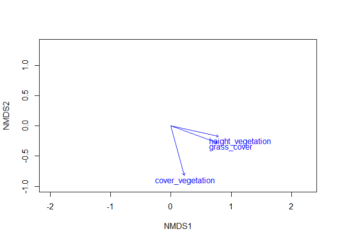

Garchinger Heide and restoration sites: <br> Plant height
================
<b>Markus Bauer</b> <br>
<b>2025-03-18</b>

- [Preparation](#preparation)
- [Statistics](#statistics)
  - [Models](#models)
  - [Model check](#model-check)
  - [Vectors](#vectors)
  - [Factors](#factors)
- [Session info](#session-info)

<br/> <br/> <b>Sina Appeltauer</b>, <b>Malte Knöppler</b>, <b>Maren
Teschauer</b> & <b>Markus Bauer</b>\*

Technichal University of Munich, TUM School of Life Sciences, Chair of
Restoration Ecology, Emil-Ramann-Straße 6, 85354 Freising, Germany

\*<markus1.bauer@tum.de>

ORCiD ID: [0000-0001-5372-4174](https://orcid.org/0000-0001-5372-4174)
<br> [Google
Scholar](https://scholar.google.de/citations?user=oHhmOkkAAAAJ&hl=de&oi=ao)
<br> GitHub: [markus1bauer](https://github.com/markus1bauer) <br>
GitHub:
[TUM-Restoration-Ecology](https://github.com/TUM-Restoration-Ecology)

To compare different models, you only have to change the models in
section ‘Load models’

# Preparation

#### Packages

``` r
library(here)
library(tidyverse)
library(vegan)
```

#### Load data

``` r
sites <- read_csv(
  here("data", "processed", "data_processed_sites.csv"),
  col_names = TRUE, na = c("na", "NA", ""), col_types =
    cols(
    .default = "?",
    treatment = col_factor(
      levels = c("control", "cut_summer", "cut_autumn", "grazing")
      )
    )
  ) %>%
  filter(is.na(location) | location != "rollfeld") %>%
  arrange(id)

species <- read_csv(
  here("data", "processed", "data_processed_species.csv"),
  col_names = TRUE, na = c("na", "NA", ""), col_types =
    cols(
      .default = "?"
    )
) %>%
  pivot_longer(-accepted_name, names_to = "id", values_to = "value") %>%
  semi_join(sites, by = "id") %>%
  arrange(id) %>%
  pivot_wider(names_from = "accepted_name", values_from = "value") %>%
  column_to_rownames(var = "id")
```

# Statistics

## Models

``` r
base::load(here("outputs", "models", "model_nmds.Rdata"))
```

``` r
ordi
## 
## Call:
## metaMDS(comm = species, distance = "bray", try = 99, previous.best = TRUE,      binary = TRUE, na.rm = TRUE) 
## 
## global Multidimensional Scaling using monoMDS
## 
## Data:     wisconsin(species) 
## Distance: binary bray 
## 
## Dimensions: 2 
## Stress:     0.1433181 
## Stress type 1, weak ties
## Best solution was not repeated after 20 tries
## The best solution was from try 8 (random start)
## Scaling: centring, PC rotation, halfchange scaling 
## Species: expanded scores based on 'wisconsin(species)'
```

## Model check

``` r
stressplot(ordi)
```

<!-- -->

``` r
goodness_of_fit <- goodness(ordi)
plot(ordi, type = "t", main = "Goodness of fit")
points(ordi, display = "sites", cex = goodness_of_fit * 300)
```

<!-- -->

## Vectors

``` r
ef_vector1 <- envfit(
  ordi ~ height_vegetation + cover_vegetation,
  data = sites,
  permu = 999,
  na.rm = TRUE
)
ef_vector1
## 
## ***VECTORS
## 
##                      NMDS1    NMDS2     r2 Pr(>r)    
## height_vegetation  0.97615 -0.21708 0.6675  0.001 ***
## cover_vegetation   0.25573 -0.96675 0.7334  0.001 ***
## ---
## Signif. codes:  0 '***' 0.001 '**' 0.01 '*' 0.05 '.' 0.1 ' ' 1
## Permutation: free
## Number of permutations: 999
plot(ordi, type = "n")
plot(ef_vector1, add = TRUE, p. = .99)
```

<!-- -->

## Factors

``` r
ef_factor1 <- envfit(
  ordi ~  treatment,
  data = sites, permu = 999, na.rm = TRUE
)
ef_factor1
## 
## ***FACTORS:
## 
## Centroids:
##                       NMDS1   NMDS2
## treatmentcontrol    -0.3750 -0.4023
## treatmentcut_summer  0.6432  0.0643
## treatmentcut_autumn  0.6133  0.0426
## treatmentgrazing    -0.4816  0.7245
## 
## Goodness of fit:
##               r2 Pr(>r)    
## treatment 0.8694  0.001 ***
## ---
## Signif. codes:  0 '***' 0.001 '**' 0.01 '*' 0.05 '.' 0.1 ' ' 1
## Permutation: free
## Number of permutations: 999
```

# Session info

    ## R version 4.4.2 (2024-10-31 ucrt)
    ## Platform: x86_64-w64-mingw32/x64
    ## Running under: Windows 11 x64 (build 26100)
    ## 
    ## Matrix products: default
    ## 
    ## 
    ## locale:
    ## [1] LC_COLLATE=German_Germany.utf8  LC_CTYPE=German_Germany.utf8   
    ## [3] LC_MONETARY=German_Germany.utf8 LC_NUMERIC=C                   
    ## [5] LC_TIME=German_Germany.utf8    
    ## 
    ## time zone: Europe/Berlin
    ## tzcode source: internal
    ## 
    ## attached base packages:
    ## [1] stats     graphics  grDevices utils     datasets  methods   base     
    ## 
    ## other attached packages:
    ##  [1] vegan_2.6-10    lattice_0.22-6  permute_0.9-7   lubridate_1.9.4
    ##  [5] forcats_1.0.0   stringr_1.5.1   dplyr_1.1.4     purrr_1.0.4    
    ##  [9] readr_2.1.5     tidyr_1.3.1     tibble_3.2.1    ggplot2_3.5.1  
    ## [13] tidyverse_2.0.0 here_1.0.1     
    ## 
    ## loaded via a namespace (and not attached):
    ##  [1] generics_0.1.3    stringi_1.8.4     hms_1.1.3         digest_0.6.37    
    ##  [5] magrittr_2.0.3    evaluate_1.0.3    grid_4.4.2        timechange_0.3.0 
    ##  [9] fastmap_1.2.0     rprojroot_2.0.4   Matrix_1.7-1      mgcv_1.9-1       
    ## [13] scales_1.3.0      cli_3.6.4         crayon_1.5.3      rlang_1.1.5      
    ## [17] bit64_4.6.0-1     munsell_0.5.1     splines_4.4.2     withr_3.0.2      
    ## [21] yaml_2.3.10       tools_4.4.2       parallel_4.4.2    tzdb_0.4.0       
    ## [25] colorspace_2.1-1  vctrs_0.6.5       R6_2.6.1          lifecycle_1.0.4  
    ## [29] bit_4.5.0.1       vroom_1.6.5       MASS_7.3-61       cluster_2.1.6    
    ## [33] pkgconfig_2.0.3   pillar_1.10.1     gtable_0.3.6      glue_1.8.0       
    ## [37] xfun_0.50         tidyselect_1.2.1  rstudioapi_0.17.1 knitr_1.49       
    ## [41] htmltools_0.5.8.1 nlme_3.1-166      rmarkdown_2.29    compiler_4.4.2
