Garchinger Heide and restoration sites: <br> R22 indicator richness
================
<b>Sina Appeltauer, Markus Bauer</b> <br>
<b>2025-03-18</b>

- [Preparation](#preparation)
- [Statistics](#statistics)
  - [Data exploration](#data-exploration)
    - [Means and deviations](#means-and-deviations)
    - [Graphs of raw data (Step 2, 6,
      7)](#graphs-of-raw-data-step-2-6-7)
    - [Outliers, zero-inflation, transformations? (Step 1, 3,
      4)](#outliers-zero-inflation-transformations-step-1-3-4)
    - [Check collinearity part 1 (Step
      5)](#check-collinearity-part-1-step-5)
  - [Models](#models)
  - [Model check](#model-check)
    - [DHARMa](#dharma)
    - [Check collinearity part 2 (Step
      5)](#check-collinearity-part-2-step-5)
  - [Model comparison](#model-comparison)
    - [<i>R</i><sup>2</sup> values](#r2-values)
    - [AICc](#aicc)
  - [Predicted values](#predicted-values)
    - [Summary table](#summary-table)
    - [Forest plot](#forest-plot)
    - [Effect sizes](#effect-sizes)
- [Session info](#session-info)

<br/> <br/> <b>Sina Appeltauer</b>, <b>Malte Knöppler</b>, <b>Maren
Teschauer</b> & <b>Markus Bauer</b>\*

Technichal University of Munich, TUM School of Life Sciences, Chair of
Restoration Ecology, Emil-Ramann-Straße 6, 85354 Freising, Germany

\*<markus1.bauer@tum.de>

ORCiD ID: [0000-0001-5372-4174](https://orcid.org/0000-0001-5372-4174)
<br> [Google
Scholar](https://scholar.google.de/citations?user=oHhmOkkAAAAJ&hl=de&oi=ao)
<br> GitHub: [markus1bauer](https://github.com/markus1bauer) <br>
GitHub:
[TUM-Restoration-Ecology](https://github.com/TUM-Restoration-Ecology)

To compare different models, you only have to change the models in
section ‘Load models’

# Preparation

Protocol of data exploration (Steps 1-8) used from Zuur et al. (2010)
Methods Ecol Evol
[DOI:10.1111/2041-210X.12577](https://doi.org/10.1111/2041-210X.12577)

#### Packages

``` r
library(here)
library(tidyverse)
library(ggbeeswarm)
library(patchwork)
library(DHARMa)
library(emmeans)
```

#### Load data

``` r
sites <- read_csv(
  here("data", "processed", "data_processed_sites.csv"),
  col_names = TRUE, na = c("", "na", "NA"), col_types = 
    cols(
      .default = "?",
      treatment = col_factor(
        levels = c("control", "cut_summer", "cut_autumn", "grazing")
      )
    )
  ) %>%
  rename(y = richness_R22) %>%
  filter(is.na(location) | location != "rollfeld")
```

# Statistics

## Data exploration

### Means and deviations

``` r
Rmisc::CI(sites$y, ci = .95)
```

    ##    upper     mean    lower 
    ## 4.918329 4.381579 3.844829

``` r
median(sites$y)
```

    ## [1] 3

``` r
sd(sites$y)
```

    ## [1] 3.349279

``` r
quantile(sites$y, probs = c(0.05, 0.95), na.rm = TRUE)
```

    ##  5% 95% 
    ##   0  11

### Graphs of raw data (Step 2, 6, 7)

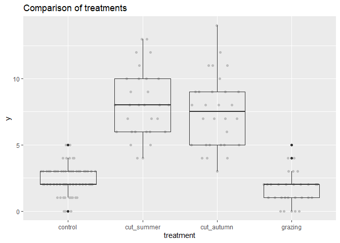<!-- -->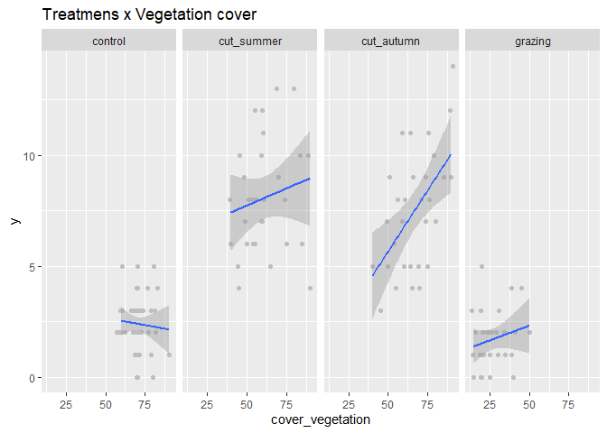<!-- -->

### Outliers, zero-inflation, transformations? (Step 1, 3, 4)

    ## # A tibble: 4 × 2
    ##   treatment      n
    ##   <fct>      <int>
    ## 1 control       62
    ## 2 cut_summer    30
    ## 3 cut_autumn    30
    ## 4 grazing       30

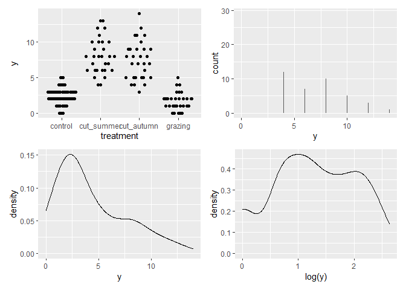<!-- -->

### Check collinearity part 1 (Step 5)

Exclude r \> 0.7 <br> Dormann et al. 2013 Ecography
[DOI:10.1111/j.1600-0587.2012.07348.x](https://doi.org/10.1111/j.1600-0587.2012.07348.x)

``` r
sites %>%
  select(height_vegetation, cover_vegetation) %>%
  GGally::ggpairs(lower = list(continuous = "smooth_loess")) +
  theme(strip.text = element_text(size = 7))
```

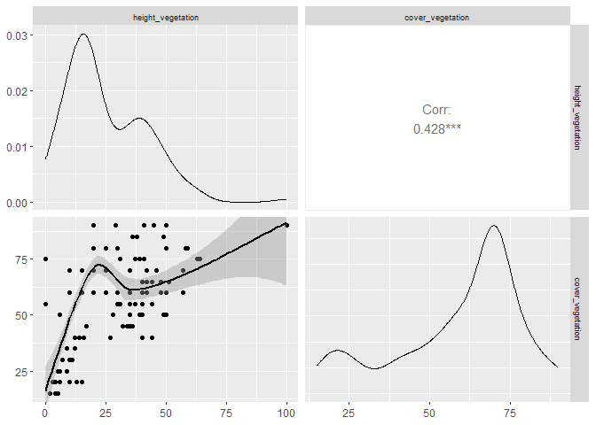<!-- -->

## Models

Only here you have to modify the script to compare other models

``` r
load(file = here("outputs", "models", "model_richness_R22_1.Rdata"))
load(file = here("outputs", "models", "model_richness_R22_2.Rdata"))
m_1 <- m1
m_2 <- m2
```

``` r
m_1
## 
## Call:
## lm(formula = y ~ treatment, data = sites)
## 
## Coefficients:
##         (Intercept)  treatmentcut_summer     treatmentgrazing  
##              2.3871               5.6796              -0.6871  
## treatmentcut_autumn  
##              5.1129
m_2
## 
## Call:
## lm(formula = y ~ treatment * cover_vegetation, data = sites)
## 
## Coefficients:
##                          (Intercept)                   treatmentcut_summer  
##                              3.29902                               2.88096  
##                     treatmentgrazing                   treatmentcut_autumn  
##                             -2.30330                              -3.13444  
##                     cover_vegetation  treatmentcut_summer:cover_vegetation  
##                             -0.01291                               0.04375  
##    treatmentgrazing:cover_vegetation  treatmentcut_autumn:cover_vegetation  
##                              0.03916                               0.12294
```

## Model check

### DHARMa

``` r
simulation_output_1 <- simulateResiduals(m_1, plot = TRUE)
```

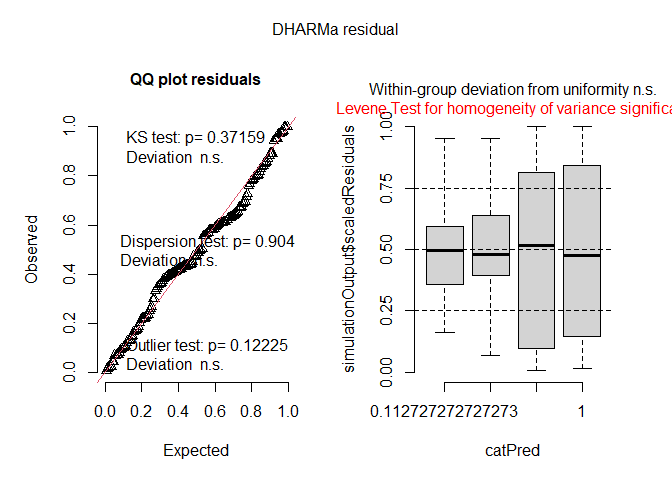<!-- -->

``` r
simulation_output_2 <- simulateResiduals(m_2, plot = TRUE)
```

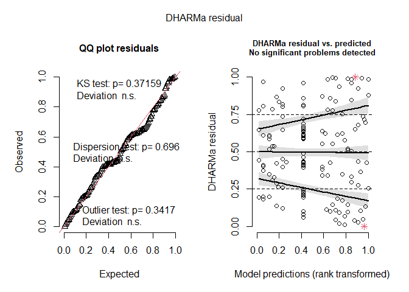<!-- -->

``` r
plotResiduals(simulation_output_1$scaledResiduals, sites$treatment)
```

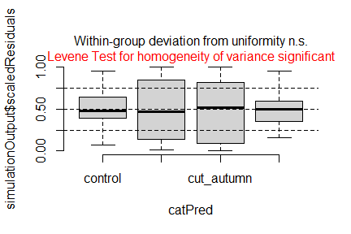<!-- -->

``` r
plotResiduals(simulation_output_2$scaledResiduals, sites$treatment)
```

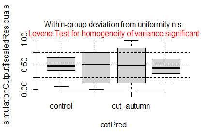<!-- -->

``` r
plotResiduals(simulation_output_1$scaledResiduals, sites$cover_vegetation)
```

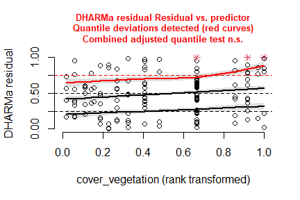<!-- -->

``` r
plotResiduals(simulation_output_2$scaledResiduals, sites$cover_vegetation)
```

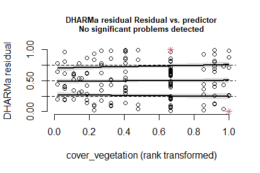<!-- -->

``` r
plotResiduals(simulation_output_1$scaledResiduals, sites$height_vegetation)
```

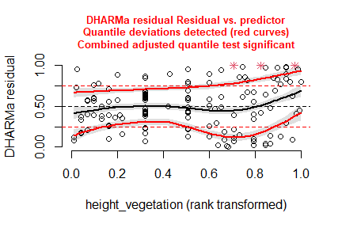<!-- -->

``` r
plotResiduals(simulation_output_2$scaledResiduals, sites$height_vegetation)
```

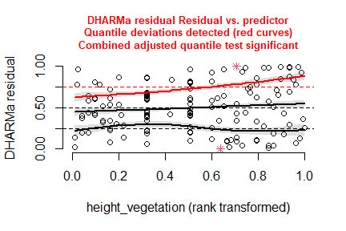<!-- -->

``` r
plotResiduals(simulation_output_1$scaledResiduals, sites$botanist)
```

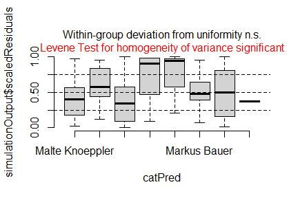<!-- -->

``` r
plotResiduals(simulation_output_2$scaledResiduals, sites$botanist)
```

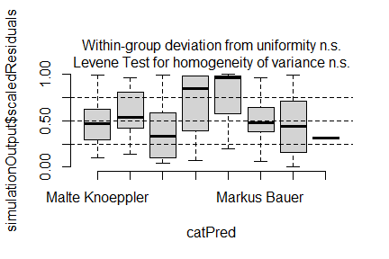<!-- -->

### Check collinearity part 2 (Step 5)

Remove VIF \> 3 or \> 10 <br> Zuur et al. 2010 Methods Ecol Evol
[DOI:10.1111/j.2041-210X.2009.00001.x](https://doi.org/10.1111/j.2041-210X.2009.00001.x)

``` r
#car::vif(m_1)
car::vif(m_2)
```

    ## there are higher-order terms (interactions) in this model
    ## consider setting type = 'predictor'; see ?vif

    ##                                   GVIF Df GVIF^(1/(2*Df))
    ## treatment                  30292.30254  3        5.583271
    ## cover_vegetation              29.09249  1        5.393746
    ## treatment:cover_vegetation 16534.49612  3        5.047370

## Model comparison

### <i>R</i><sup>2</sup> values

``` r
MuMIn::r.squaredGLMM(m_1)
##           R2m      R2c
## [1,] 0.681363 0.681363
MuMIn::r.squaredGLMM(m_2)
##           R2m      R2c
## [1,] 0.718933 0.718933
```

### AICc

Use AICc and not AIC since ratio n/K \< 40 <br> Burnahm & Anderson 2002
p. 66 ISBN:
[978-0-387-95364-9](https://search.worldcat.org/de/title/845688581)

``` r
MuMIn::AICc(m_1, m_2) %>%
  arrange(AICc)
##     df     AICc
## m_2  9 618.9461
## m_1  5 632.2957
```

## Predicted values

### Summary table

``` r
summary(m_1)
```

    ## 
    ## Call:
    ## lm(formula = y ~ treatment, data = sites)
    ## 
    ## Residuals:
    ##     Min      1Q  Median      3Q     Max 
    ## -4.5000 -1.3871 -0.0667  0.6129  6.5000 
    ## 
    ## Coefficients:
    ##                     Estimate Std. Error t value Pr(>|t|)    
    ## (Intercept)           2.3871     0.2409   9.910   <2e-16 ***
    ## treatmentcut_summer   5.6796     0.4218  13.465   <2e-16 ***
    ## treatmentgrazing     -0.6871     0.4218  -1.629    0.105    
    ## treatmentcut_autumn   5.1129     0.4218  12.121   <2e-16 ***
    ## ---
    ## Signif. codes:  0 '***' 0.001 '**' 0.01 '*' 0.05 '.' 0.1 ' ' 1
    ## 
    ## Residual standard error: 1.897 on 148 degrees of freedom
    ## Multiple R-squared:  0.6857, Adjusted R-squared:  0.6793 
    ## F-statistic: 107.6 on 3 and 148 DF,  p-value: < 2.2e-16

### Forest plot

``` r
dotwhisker::dwplot(
  list(m_1, m_2),
  ci = 0.95,
  show_intercept = FALSE,
  vline = geom_vline(xintercept = 0, colour = "grey60", linetype = 2)) +
  xlim(-0.3, 0.35) +
  theme_classic()
```

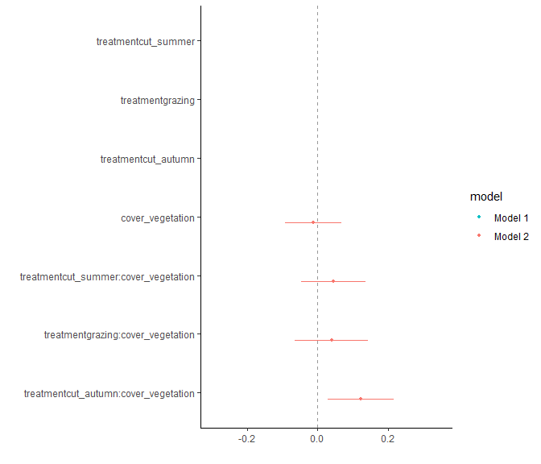<!-- -->

### Effect sizes

Effect sizes of chosen model just to get exact values of means etc. if
necessary.

``` r
(emm <- emmeans(
  m_1,
  revpairwise ~ treatment,
  type = "response"
  ))
```

    ## $emmeans
    ##  treatment  emmean    SE  df lower.CL upper.CL
    ##  control      2.39 0.241 148     1.91     2.86
    ##  cut_summer   8.07 0.346 148     7.38     8.75
    ##  grazing      1.70 0.346 148     1.02     2.38
    ##  cut_autumn   7.50 0.346 148     6.82     8.18
    ## 
    ## Confidence level used: 0.95 
    ## 
    ## $contrasts
    ##  contrast                estimate    SE  df t.ratio p.value
    ##  cut_summer - control       5.680 0.422 148  13.465  <.0001
    ##  grazing - control         -0.687 0.422 148  -1.629  0.3656
    ##  grazing - cut_summer      -6.367 0.490 148 -13.001  <.0001
    ##  cut_autumn - control       5.113 0.422 148  12.121  <.0001
    ##  cut_autumn - cut_summer   -0.567 0.490 148  -1.157  0.6547
    ##  cut_autumn - grazing       5.800 0.490 148  11.844  <.0001
    ## 
    ## P value adjustment: tukey method for comparing a family of 4 estimates

``` r
plot(emm, comparison = TRUE)
```

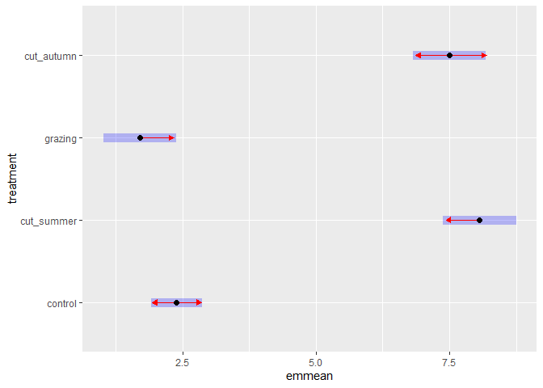<!-- -->

# Session info

    ## R version 4.4.2 (2024-10-31 ucrt)
    ## Platform: x86_64-w64-mingw32/x64
    ## Running under: Windows 11 x64 (build 26100)
    ## 
    ## Matrix products: default
    ## 
    ## 
    ## locale:
    ## [1] LC_COLLATE=German_Germany.utf8  LC_CTYPE=German_Germany.utf8   
    ## [3] LC_MONETARY=German_Germany.utf8 LC_NUMERIC=C                   
    ## [5] LC_TIME=German_Germany.utf8    
    ## 
    ## time zone: Europe/Berlin
    ## tzcode source: internal
    ## 
    ## attached base packages:
    ## [1] stats     graphics  grDevices utils     datasets  methods   base     
    ## 
    ## other attached packages:
    ##  [1] emmeans_1.10.7   DHARMa_0.4.7     patchwork_1.3.0  ggbeeswarm_0.7.2
    ##  [5] lubridate_1.9.4  forcats_1.0.0    stringr_1.5.1    dplyr_1.1.4     
    ##  [9] purrr_1.0.4      readr_2.1.5      tidyr_1.3.1      tibble_3.2.1    
    ## [13] ggplot2_3.5.1    tidyverse_2.0.0  here_1.0.1      
    ## 
    ## loaded via a namespace (and not attached):
    ##  [1] tidyselect_1.2.1   vipor_0.4.7        farver_2.1.2       fastmap_1.2.0     
    ##  [5] GGally_2.2.1       bayestestR_0.15.2  promises_1.3.2     digest_0.6.37     
    ##  [9] estimability_1.5.1 timechange_0.3.0   mime_0.12          lifecycle_1.0.4   
    ## [13] magrittr_2.0.3     compiler_4.4.2     rlang_1.1.5        tools_4.4.2       
    ## [17] utf8_1.2.4         yaml_2.3.10        knitr_1.49         labeling_0.4.3    
    ## [21] bit_4.5.0.1        ggstance_0.3.7     plyr_1.8.9         RColorBrewer_1.1-3
    ## [25] gap.datasets_0.0.6 abind_1.4-8        withr_3.0.2        datawizard_1.0.0  
    ## [29] stats4_4.4.2       grid_4.4.2         xtable_1.8-4       colorspace_2.1-1  
    ## [33] scales_1.3.0       iterators_1.0.14   MASS_7.3-61        insight_1.0.2     
    ## [37] cli_3.6.4          mvtnorm_1.3-3      dotwhisker_0.8.3   rmarkdown_2.29    
    ## [41] crayon_1.5.3       reformulas_0.4.0   generics_0.1.3     performance_0.13.0
    ## [45] rstudioapi_0.17.1  tzdb_0.4.0         parameters_0.24.1  minqa_1.2.8       
    ## [49] splines_4.4.2      parallel_4.4.2     vctrs_0.6.5        boot_1.3-31       
    ## [53] Matrix_1.7-1       carData_3.0-5      car_3.1-3          hms_1.1.3         
    ## [57] bit64_4.6.0-1      Formula_1.2-5      qgam_1.3.4         beeswarm_0.4.0    
    ## [61] Rmisc_1.5.1        foreach_1.5.2      gap_1.6            glue_1.8.0        
    ## [65] nloptr_2.1.1       ggstats_0.8.0      codetools_0.2-20   stringi_1.8.4     
    ## [69] gtable_0.3.6       later_1.4.1        lme4_1.1-36        munsell_0.5.1     
    ## [73] pillar_1.10.1      htmltools_0.5.8.1  R6_2.6.1           Rdpack_2.6.2      
    ## [77] doParallel_1.0.17  rprojroot_2.0.4    vroom_1.6.5        evaluate_1.0.3    
    ## [81] shiny_1.10.0       lattice_0.22-6     rbibutils_2.3      httpuv_1.6.15     
    ## [85] Rcpp_1.0.14        gridExtra_2.3      coda_0.19-4.1      nlme_3.1-166      
    ## [89] MuMIn_1.48.4       mgcv_1.9-1         xfun_0.50          pkgconfig_2.0.3
